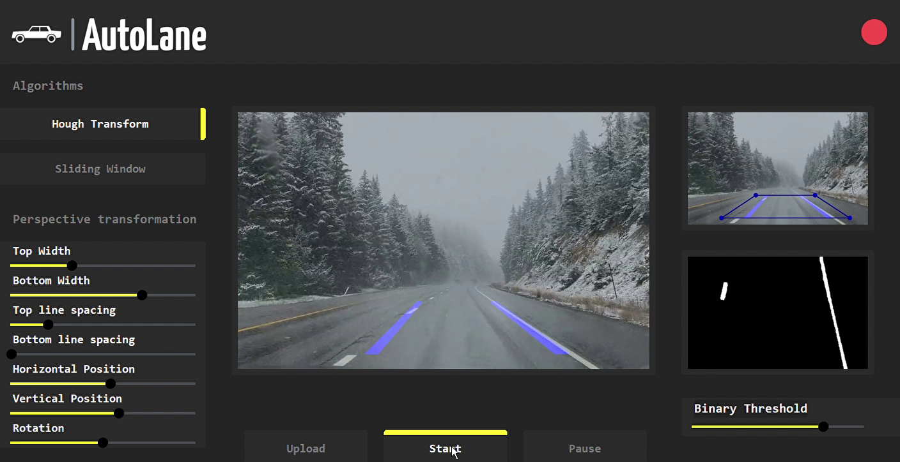

# Video Lane Detection Application

## Overview

This application enables video lane detection using Hough transform and sliding window algorithms. The UI, built with customTkinter (CTK), facilitates a seamless user experience. The entire project is developed from scratch in Python, complemented by detailed Jupyter notebooks illustrating each process.

## Folder Structure

The project consists of the following structure:

- `python_files`: Contains essential Python files and classes utilized in the main application.
- `UI`: Includes the icon image and `interface.py`, the primary file hosting the main code for the UI.
- `notebooks`: Jupyter notebooks detailing each step of the project's processes.
- `Videos`: Video samples of different roads with different conditions to try the application on.

## Dependencies
- numpy
- opencv2
- scikit-image (skimage)
- matplotlib
- ipywidgets

## Usage

### Using the UI

The UI facilitates video lane detection through the following steps:

1. **Algorithm Selection**: Choose between the available lane detection algorithms: Hough Transform or Sliding Window.
2. **Uploading Video**: Upload a video file onto the interface for lane detection analysis.
3. **Perspective Transformation Adjustment**: Utilize sliders to modify transformation parameters until clear lane views are achieved.
4. **Gray to Binary Threshold**: Fine-tune the threshold slider to optimize grayscale-to-binary conversion.
5. **Initiating Lane Detection**: Click the 'Start' button to commence the lane detection process.
   



## Limitations

Lane detection accuracy may vary due to factors such as camera positioning, road conditions, and weather. Additionally, note that the Hough Transform algorithm might be slower compared to Sliding Window, also it is worth mentioning that the accuracy of the results depends heavily on choosing appropriate parameters for perspective transformation.

For a comprehensive understanding of the application functionalities and processes, refer to the provided Jupyter notebooks.


<p align="center">
    
</p>


---
## Building Executable (.exe)

In order to create an executable with PyInstaller, use the following command:

```bash
pyinstaller --onefile -w --noconsole --icon=UI/car.ico --add-data "UI/logo.png;UI" --add-data "python_files;python_files" --name=AutoLane UI/interface.py
```
After that, move the executable from `dist` folder to the main folder and remove `build`, `dist` directories and `AutoLane.spec` file.
